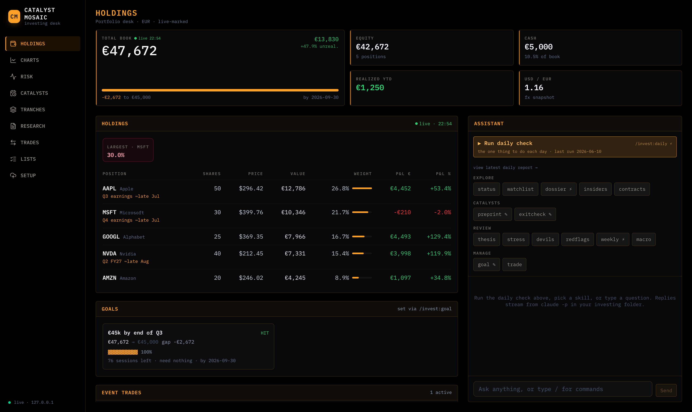
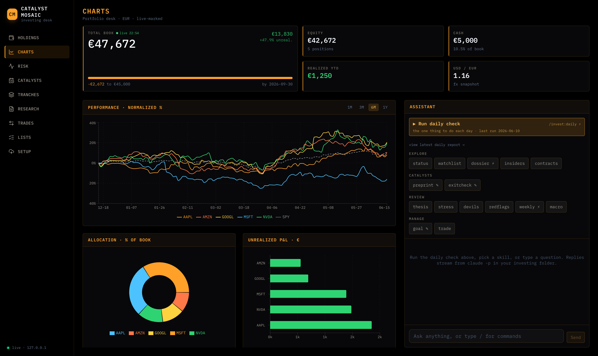
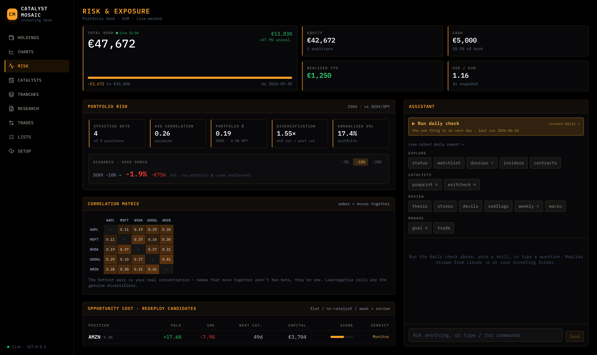
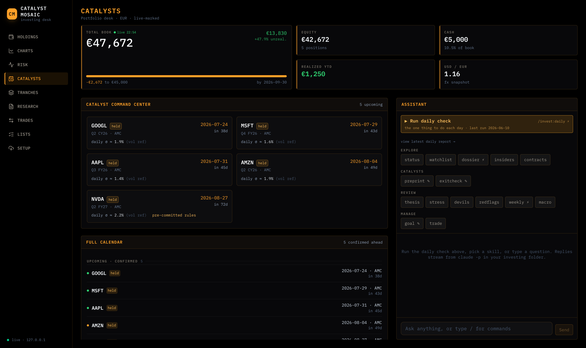
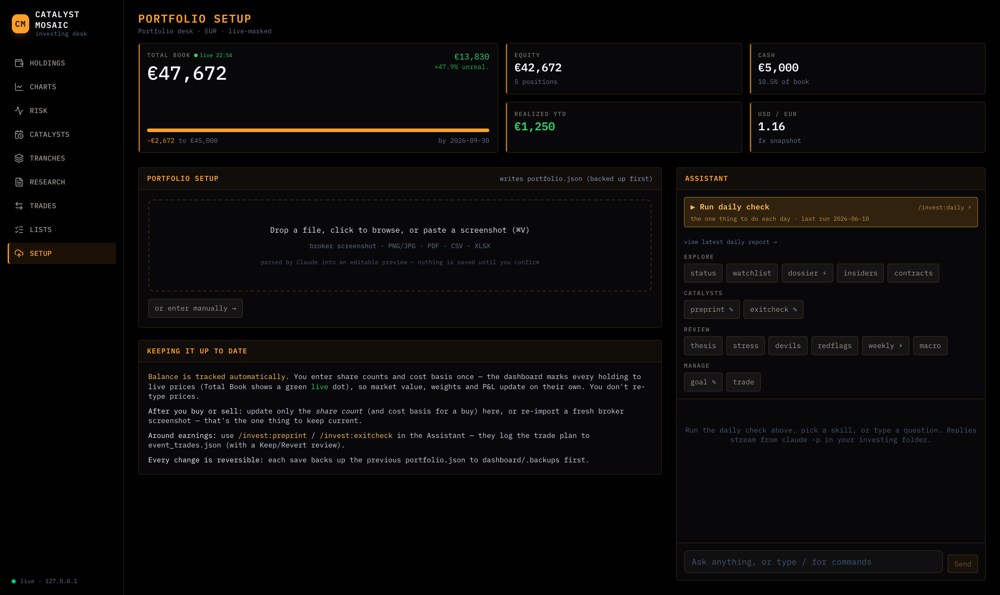
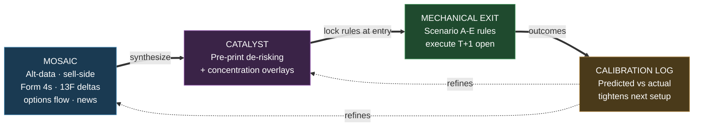
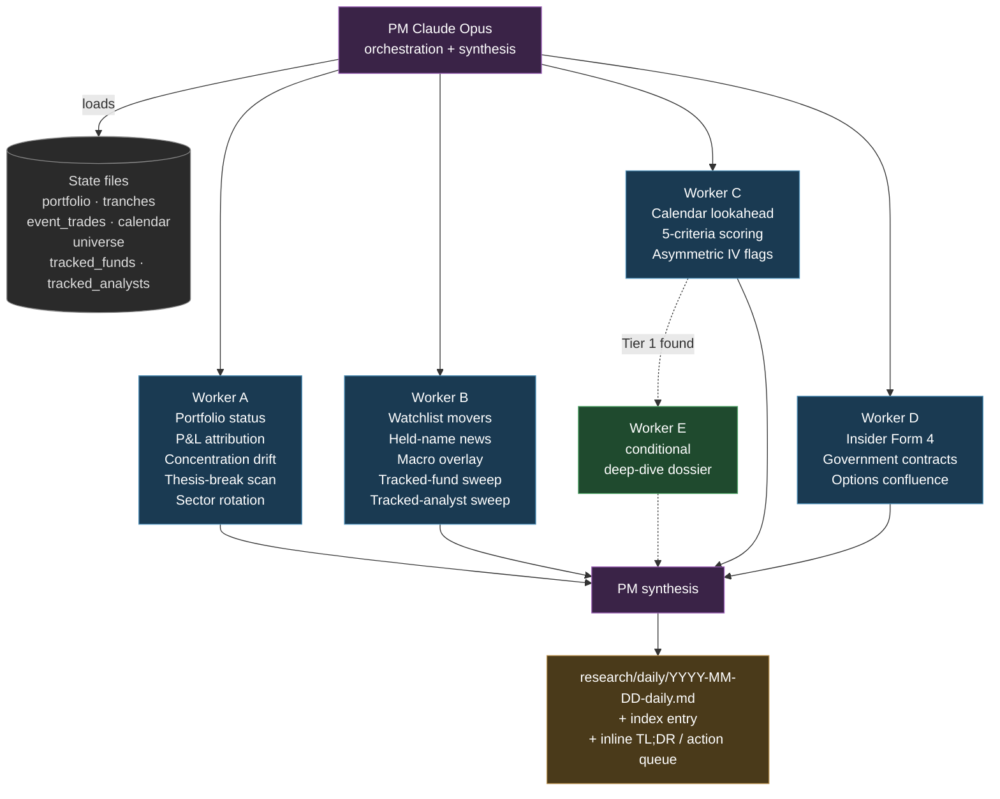
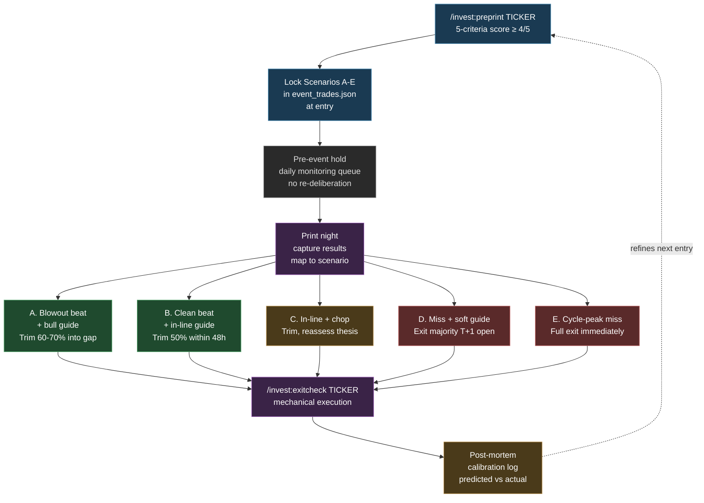

# Catalyst-Mosaic Investing

> A solo-PM framework that runs your book like a tech-specialist concentrated-long pod shop. Multi-agent research, pre-committed playbooks, mechanical exits.

## 🖥️ Dashboard

A local, Bloomberg-terminal-styled **web cockpit** for the framework — glance at your live-marked book, drill into risk and catalysts, and run the `/invest:*` skills from the browser. Runs entirely on `localhost`; ships with fictional sample data so it works the moment you clone.



**Highlights**

- **Live-marked book** — holdings and totals recompute from live prices automatically; you only re-enter share counts when you trade.
- **Risk & exposure** — correlation heatmap, effective-bets, portfolio β, a benchmark-shock scenario, and an opportunity-cost redeploy ranker.
- **Catalyst command-center** — earnings countdowns with pre-committed exit rules, plus the full calendar.
- **Import wizard** — drop or paste a broker screenshot, PDF, CSV or XLSX → Claude parses it into an editable preview → saves your portfolio (previous file backed up first).
- **Assistant** — the `/invest:*` skills stream live; write-skills are gated by a snapshot + Keep/Revert diff review.

<table>
  <tr>
    <td width="50%"></td>
    <td width="50%"></td>
  </tr>
  <tr>
    <td width="50%"></td>
    <td width="50%"></td>
  </tr>
</table>

```bash
cd dashboard/server && npm install && npm run dev   # API → http://127.0.0.1:4317
cd dashboard/web    && npm install && npm run dev   # UI  → http://127.0.0.1:5173
```

Full docs: [`dashboard/README.md`](dashboard/README.md) · [release notes](dashboard/RELEASE_NOTES.md)

---

## Philosophy

Most retail investors lose to two things: poor information synthesis (mosaic gaps) and behavioral failure at the catalyst (holding through post-print gap-ups expecting more, freezing on miss, sizing on euphoria). This framework attacks both.

**Catalyst-mosaic investing** is the loop:

1. **Mosaic**: assemble a multi-source intelligence picture. Alt-data (TrendForce, DRAMeXchange, DigiTimes, Korean memory press, LinkedIn hiring trends, Glassdoor sentiment). Sell-side primary research (PT revisions from named tier-1 analysts, conference fireside chats). Insider Form 4 filings filtered to open-market purchases over $500k. 13F deltas from concentrated tech-specialist funds (Coatue, Whale Rock, Aschenbrenner, Druckenmiller). Options flow (unusual call sweeps, dark pool prints, P/C ratio shifts). News and contract flow (SAM.gov, USAspending.gov, 8-K dockets). No single source is the edge; the synthesis is.

2. **Catalyst**: find the asymmetric setup. Two flavors dominate:
   * *Pre-print de-risking*: positioning is washed out (long funds trimmed, IV ramped, sell-side previews cautious, stops triggered, stock weak versus sector). A beat triggers IV crush plus relief rally plus positioning unwind. Five-criteria filter screens the setup; only Tier 1 (4 or more of 5) is fundable. Pre-committed Scenario A through E exit rules lock at entry.
   * *Concentration overlay on thematic core*: when an institutional catalyst (Street-high PT revision from a named tier-1 analyst, structural thesis upgrade, tracked-fund 13F adds, channel-check confirmation) stacks against an already-held conviction position, deliberately breach the single-name cap for the binary window. Mechanical exits restore sizing post-event.

3. **Mechanical exit**: pre-committed Scenario A through E rules execute on print night plus one. No discretionary "let me see how it trades" reassessment. The framework exists precisely because the moment of decision is when judgment fails. Calibration log captures predicted versus actual after every event so the rules tighten over time.

The framework is opinionated, not neutral. It outputs concrete buy / trim / hold / sell recommendations with conviction and sizing, not a balanced summary of considerations.



## Pod-shop architecture

Inspired by multi-manager hedge fund structures (Millennium, Citadel, Point72 pod shops), with Claude playing both PM and research analyst roles:

* **PM (Claude Opus)**: orchestrates workflow, weighs worker outputs against tranche-classified portfolio state, surfaces concentration math, makes the final call with conviction.
* **Research workers (Claude Sonnet)**: 4 to 5 parallel sub-agents per daily run. Each owns a domain (portfolio status, watchlist movers, calendar lookahead and setup scoring, insider and contract flow). Hard output contracts (word limits, mandatory cited sources, structured markdown templates) keep them disciplined.
* **Conditional deep-dive worker**: spawned only when a Tier 1 setup candidate emerges not already in the dossier system. Avoids wasted compute on the modal flat day.



This is the inverse of a traditional retail tool. Where Robinhood-style apps optimize for activity (more trades equal more PFOF), this optimizes for discipline (more pre-commitment equals lower behavioral error).

## Quick start

```bash
git clone <repo> && cd catalyst-mosaic-investing

# Copy templates to live state files (gitignored)
cp portfolio.example.json portfolio.json
cp tranches.example.json tranches.json
cp event_trades.example.json event_trades.json
touch trades.log.jsonl

# Customize universe (the included file is AI-thematic; swap for your thesis)
$EDITOR universe.json
```

Then open Claude Code in the repo directory. The `.claude/commands/invest/*.md` files auto-load as slash commands. Run `/invest:status` to verify the framework reads your state correctly. Run `/invest:daily` for the full multi-agent routine.

All personal data files (`portfolio.json`, `trades.log.jsonl`, `snapshots/`, `research/`) are gitignored by default. Your book stays local.

## Ground rules

* **Base currency**: configured in `portfolio.json` (EUR in default config). Per-share prices shown in local currency (USD for US listings).
* **Claude owns decisions, you execute**. Concrete recommendations with conviction and sizing, not neutral research.
* **Investment universe**: `universe.json` is the single source of truth for tickers tracked across all tiers. New ideas welcome when they clear the thesis bar.
* **Portfolio state lives in `portfolio.json`**. Update via the Ingest workflow (paste broker confirmation) so `trades.log.jsonl` stays consistent. Never hand-edit mid-session.
* **Pre-committed exit rules are non-negotiable**. Scenarios A through E execute mechanically. The framework's value is preventing post-print emotional reassessment.
* **Hard exclusions are respected absolutely**. Tickers user has permanently flagged on tech-quality grounds stay out of all scans, comps, recommendations.
* **Tax context lives in memory** and modifies sizing recommendations (account type, jurisdiction-specific rates, deferred versus realized treatment).
* **Not investment advice**. Personal research tool. All decisions are the user's.

## Tranche framework

Every position has a `tranche_type` that determines exit logic. This is the conceptual backbone:

| Tranche | Sizing | Exit logic |
|---|---|---|
| **`thematic_core`** | At target weight. Multi-quarter to multi-year horizon. | Don't trim on thesis-confirming news. Trim on thesis break or weight exceeding 1.5x target tolerance. |
| **`event_trade`** | Larger than thematic, time-bound to a specific catalyst. | Pre-committed Scenario A through E rules locked at entry. Mechanical execution post-catalyst. |
| **`catalyst_concentration_overlay`** | Adds on top of `thematic_core`. Often deliberately breaches single-name cap. | Pre-committed scenario matrix in `event_trades.json`. No discretionary deviation. Restores to core sizing post-event. |
| **`scout_active`** / **`scout_monitor`** / **`hype_speculation`** | 0.5 to 3% per name. 10% combined speculative cluster cap. | Per `universe.json` tier rules plus time-stops. Hard 30% drawdown stop on `hype_speculation`. |
| **`tactical_swing`** | Reserved (not used in default config). | Hard time-stop, ATR-based exits. |

**Concentration caps** (default; tune in `tranches.example.json` framework section):

| Cap | Value |
|---|---|
| Single name (hard) | 20% |
| Single thematic cluster (target) | 55% |
| Single thematic cluster (absolute) | 60% |
| Combined speculative cluster | 10% |
| Cash buffer through earnings wall | 5% minimum |

Deliberate cap breaches are allowed for `catalyst_concentration_overlay` trades. The breach must be logged with rationale in `event_trades.json` and reverts mechanically post-event.

## Workflows

### `/invest:daily` (morning routine)

Spec: `daily_run.md`. Total compute roughly 250 to 330k tokens per run.

1. PM loads state across 9 files (portfolio, event_trades, tranches, earnings_calendar, watch_list_normalized, scout_universe, tracked_funds, tracked_analysts, memory).
2. 4 parallel Sonnet workers fire in a single message:
   * **Worker A**: portfolio status. Day-over-day P&L attribution. Concentration drift. Drawdown tier scan. Thesis-break trigger scan per `tranches.json`. Sector rotation read (SMH versus XLU versus SPY 30-day relative strength).
   * **Worker B**: watchlist movers (plus or minus 5% in 24 to 72 hours with named catalyst). Held-name news. Macro overlay (yields, Fed-speak, geopolitics). Tracked-fund and tracked-analyst sweep. Scout-active material moves.
   * **Worker C**: calendar lookahead (next 5 sessions). De-risking setup scoring against 5 criteria. Asymmetric IV setup flags (implied move below historical realized).
   * **Worker D**: insider Form 4 filtered to high-signal (open-market over $500k personal funds). Government contract scan (SAM.gov, USAspending.gov, 8-K dockets). Options-flow confluence.
3. Conditional Worker E: targeted deep-dive on a Tier 1 candidate not already covered in `research/ticker-reports/`.
4. PM synthesizes. Output to `research/daily/YYYY-MM-DD-daily.md` plus running index entry. Inline TL;DR, action queue, monitoring queue.

### `/invest:weekly` (Sunday deep review)

5 parallel Investment Researcher analysts on highest-attention names. Concentration check, week-over-week attribution, sector rotation read. Per-name analyst summaries with conviction. Cross-position trade-offs and capital reallocation. Monday action list plus pre-committed conditional triggers.

### `/invest:macro` (Sunday evening)

Spec: `macro_run.md`. Next week's macro calendar (Fed, BLS, BEA, Treasury, ISM, geopolitical). Top 3 events with per-event sensitivity mapping to held positions (HIGH / MEDIUM / LOW with one-line rationale each). Cross-reference held names printing in the same window for compound-binary-risk flags.

### `/invest:dossier [TICKER]`

Bull and bear analysts run in parallel. PM synthesizes both sides. Business snapshot, recent results, key drivers, valuation versus peers, fit with existing portfolio. BUY / WAIT / PASS verdict with conviction and sizing.

### Event-trade lifecycle

1. `/invest:preprint [TICKER]` scores the setup against 5-criteria filter. If 4 of 5 or better and fundable, **locks pre-committed Scenario A through E exit rules into `event_trades.json` at entry.**
2. Pre-event hold. Daily monitoring queue tracks setup integrity. No re-deliberation.
3. Print night. Capture results, map to pre-committed scenario.
4. `/invest:exitcheck [TICKER]` references the locked rule and outputs trim / hold / exit. Mechanical execution next morning.
5. Post-mortem. Calibration entry added to `event_trades.json` (predicted versus actual, lesson captured).



### Concentration-overlay lifecycle

Same skeleton as event trade but sized aggressively (30 to 45% of book typical) for a specific window catalyst. Used when conviction-weighted sizing argues for breaching the 20% single-name cap. Pre-print trim ladders (price triggers like "trim 5 sh at $1,000 to $1,050") provide opportunistic profit-take optionality without losing print exposure on the remainder.

### Ingest

* **Broker screenshot path**: parse columns, derive cost basis, diff against `portfolio.json`, append trade events to `trades.log.jsonl`, archive image to `snapshots/`.
* **Trade confirmation paste path**: parse trade details, append `buy_confirmation` or `sell_confirmation` events with realized P&L, update positions.

## Slash commands

All commands under unified `/invest:NAME` namespace. Run `/invest:help` for the current list. Tab-complete works.

| Group | Commands |
|---|---|
| Routine | `/invest:daily`, `/invest:weekly`, `/invest:macro`, `/invest:status` |
| Decision tools | `/invest:preprint`, `/invest:exitcheck`, `/invest:trade` |
| Research | `/invest:dossier`, `/invest:redflags`, `/invest:watchlist`, `/invest:thesis` |
| Signal scans | `/invest:insiders`, `/invest:contracts` |
| Stress tests | `/invest:stress`, `/invest:devils` |
| Reference | `/invest:help` |

## Tracked institutional signals

The framework treats the institutional signal layer as confirming evidence, not primary trade driver. The 45-day 13F lag means signals are stale on execution timing, but useful for thesis triangulation, idea sourcing, and cross-fund confluence detection.

### Funds (`tracked_funds.json`)

Selection criteria: concentrated tech-specialist allocators (not multi-strat, not macro). Strategy that allows the 13F to reveal directional conviction (long-only or long-biased; HFT and quant pod shops are excluded because 13F snapshots are inventory, not bets).

Default tracked cohort:
* **Situational Awareness LP** (Aschenbrenner). $3.86B post Q1 2026 13F. Concentrated AI-infrastructure long with aggressive options overlay (puts for hedging, calls for catalyst expression).
* **Coatue Management** (Laffont). $50B tech-specialist long-short with private-market exposure (Anthropic, xAI, Mistral).
* **Whale Rock Capital** (Sacerdote). $10B concentrated tech-growth.
* **D1 Capital** (Sundheim). $22B tech-growth long-short, Viking lineage.
* **Duquesne Family Office** (Druckenmiller). $4B macro-aware concentrated bets. Best signal layer for sector rotation calls.
* **Berkshire Hathaway** (Buffett / Combs / Weschler). Reference only. Contrarian quality signal for tech-name adds (rare).

### Analysts (`tracked_analysts.json`)

Selection criteria: PT revisions historically move the stock more than 5% on day-of, plus out-of-consensus calls (not just price-following). Default tracked: Timothy Arcuri at UBS (semiconductors). Candidates queued for future addition: Stacy Rasgon (Bernstein), Vivek Arya (BofA), Vijay Rakesh (Mizuho), Harlan Sur (JPMorgan), C.J. Muse (Cantor).

Both layers integrate via Worker B in every daily run. Flagged as `TRACKED-FUND ALIGNMENT` and `[ANALYST] PT CHANGE` callouts when material. Cross-fund confluence (3 or more tracked funds holding the same name) flagged as `STRONG ALIGNMENT`. Institutional accumulation paired with low retail attention flagged as `INSTITUTIONAL ACCUMULATION + LOW RETAIL ATTENTION` (the smart-money-loading-before-crowd-notices setup, ONDS template circa 2024).

## Scout universe

`universe.json` is the wide-net thematic small/mid-cap pool. Default config covers 15 sub-themes: drones and counter-UAS, robotics and humanoid, lidar and AV, edge AI specialty silicon, AI software and agents, AI power (SMR, neoclouds, solar), AI photonics, space and satellite, AI cybersecurity, AI healthcare and drug discovery, specialty defense and hypersonics, battery storage and data-center power, naval autonomous, voice and audio, quantum compute, rare earths and critical materials.

Each name scored against 5-signal scorecard:

1. M&A capability tuck (thematic-direction acquisitions expanding TAM).
2. First-named DoD or hyperscaler contract (specific customer plus specific dollars).
3. Strategic equity from tier-1 tech (NVentures, hyperscaler corp-VC, tracked-fund 13F overlap).
4. Revenue or backlog inflection (backlog growth leads revenue by 3 to 12 months).
5. International or second-customer validator (foreign government, second OEM, second hyperscaler).

Tier assignment:

| Tier | Signals | Sizing |
|---|---|---|
| `scout_active` | 3 or more of 5 | 2 to 3% per name |
| `scout_monitor` | 1 or 2 of 5 | 1 to 2% per name |
| `hype_speculation` | Momentum or narrative play, fewer fundamental signals | 0.5 to 1% per name. Hard 30% drawdown stop. 90-day time box. |
| `scout_archive` | Graduated to watchlist, or thesis broke, or post-discovery beyond entry window | none |
| `pre_ipo_watch` | Private companies on near-term IPO track | Evaluate at S-1 filing |

The scout layer is explicitly speculative. Combined cap is 10% of book. Per-name caps unchanged. The framework exists to harvest occasional 5x to 20x outliers (the ONDS template) while bounding cluster downside.

## Behavioral guardrails

These are durable framework rules captured in memory and respected across sessions:

* **Don't trim on thesis-confirming news** (`thematic_core` rule). Trim on weight breach or thesis break, not on a winner running.
* **Event-trade exits are not thematic-position exits**. Trim 30 to 50% of event trades into post-print gap-ups. Recoil and IV-crush are real (stocks that gap +8% plus on prints fade roughly 30 to 50% of the gap within a week on average).
* **User-initiated buy interest plus bull analyst BUY equals starter at current price**, not WAIT-for-pullback. Pullback-defaulting on confirmed interest left meaningful upside on the table historically.
* **Surface aggregate concentration math proactively** when user upsizes recommendations 1.5x to 3x. The user trusts their conviction sizing; the PM job is to make the cluster implications legible, not to lecture on risk tolerance.
* **Pre-committed rules beat discretionary judgment at decision time**. The framework exists because the moment of the catalyst is when judgment fails. Bad rules executed mechanically beat good rules reasoned around.
* **Hard exclusions are absolute**. No exceptions, no comp-adjacent recommendations, no "but consider this similar name."
* **Don't push trim or discipline recs more than once**. State the math, surface the trade-off, defer to user conviction. Re-pushing is paternalistic.

## Configuration notes

The framework is opinionated toward AI-infrastructure / AI-power / critical-materials thematic concentration in the default config, with a daily-cadence retail constraint. It works equally well for any other concentrated thesis with these substitutions:

1. Replace `portfolio.example.json` and `event_trades.example.json` with your own holdings and trade playbooks.
2. Replace `universe.json` with your scout pool (sub-themes organized by thematic adjacency).
3. Adjust concentration caps in `tranches.example.json` framework section to your risk tolerance.
4. Adjust tracked funds and analysts to fit sector focus (energy-specialist book wants different funds than AI-infra book).

The slash commands, multi-agent orchestration, pre-committed exit rules, and PM synthesis logic are thesis-agnostic.

## What this framework is not

* Not a robo-advisor. It does not execute trades.
* Not a balanced research summary tool. It outputs opinionated recommendations.
* Not a passive index strategy. The default config is concentrated and active.
* Not a backtesting engine. The calibration log captures forward-walk discipline only.
* Not a quant signal generator. Mosaic synthesis is qualitative-quantitative hybrid, not pure-quant.
* Not low-cost in compute terms. A full daily run is roughly 250 to 330k tokens. Cost discipline matters at scale.
* Not appropriate for capital you cannot afford to lose. Concentrated single-name positions carry significant downside risk that no exit-rule framework eliminates.

## Disclaimer

Not investment advice. Personal research framework. All decisions are the user's. Past performance does not predict future returns. Concentrated single-name positions carry significant downside risk. Pre-committed exit rules exist because the most common failure mode is holding through post-print gap-ups expecting more, but rules are only as good as their execution. The framework reduces behavioral error; it does not eliminate market risk.
