# Setup architecture

Three views: (1) component map, (2) trade lifecycle, (3) daily-run multi-agent fan-out.

---

## 1. Component map — who reads, who writes, who only watches

```mermaid
flowchart TB
    User([User])

    subgraph MainSession["Main session — PM (Opus 4.7)"]
        PM["PM Agent<br/>SOLE writer of state files<br/>Owns verdicts + sizing"]
    end

    subgraph Memory["~/.claude/.../memory/"]
        Mem[("user_*.md<br/>feedback_*.md<br/>project_*.md<br/>MEMORY.md (index)")]
    end

    subgraph State["Project state files (mutable)"]
        Port[("portfolio.json")]
        TradesLog[("trades.log.jsonl<br/>append-only")]
        Tranch[("tranches.json")]
        Events[("event_trades.json")]
    end

    subgraph RefData["Reference data (read-only)"]
        Cal[("earnings_calendar.json")]
        Watch[("watch_list_normalized.csv")]
        Strat[/"earnings_strategy.md<br/>5-criteria filter"/]
        DailyMd[/"daily_run.md spec"/]
        AgentsMd[/"agents.md spec"/]
        Prompts[/"prompts.md"/]
    end

    subgraph Subagents["Sonnet subagents — read-only on state, spawned in parallel"]
        WA["Worker A<br/>status"]
        WB["Worker B<br/>news/movers"]
        WC["Worker C<br/>setup scoring"]
        WD["Worker D<br/>insider/contract"]
        WE["Worker E<br/>conditional deep-dive"]
        Bull["Bull researcher<br/>(dossier)"]
        Bear["Bear researcher<br/>(dossier)"]
    end

    subgraph Reports["research/ outputs"]
        DR[("daily/")]
        TR[("ticker-reports/")]
        DC[("decisions/")]
    end

    Internet[(Web<br/>WebSearch/WebFetch)]

    User -->|"slash commands<br/>trade confirmation pastes<br/>holdings screenshots<br/>ad-hoc questions"| PM
    PM -->|"TL;DR + action queue<br/>verdicts<br/>recommendations"| User

    PM ---|read/write| Port
    PM ---|append| TradesLog
    PM ---|read/write| Tranch
    PM ---|read/write| Events
    PM -->|read| Cal
    PM -->|read| Watch
    PM -->|read| Strat
    PM -->|read| DailyMd
    PM -->|read| AgentsMd
    PM -->|read| Prompts
    PM ---|read/write| Mem

    PM -.->|spawn| WA
    PM -.->|spawn| WB
    PM -.->|spawn| WC
    PM -.->|spawn| WD
    PM -.->|spawn IF Tier 1| WE
    PM -.->|spawn pair| Bull
    PM -.->|spawn pair| Bear

    WA -->|read| Port
    WB -->|fetch| Internet
    WC -->|read| Cal
    WC -->|fetch| Internet
    WD -->|fetch| Internet
    WE -->|fetch| Internet
    Bull -->|fetch + write| Internet
    Bear -->|fetch + write| Internet

    WA -->|summary| PM
    WB -->|summary| PM
    WC -->|summary| PM
    WD -->|summary| PM
    WE -->|playbook| PM
    Bull -->|writes| TR
    Bear -->|writes| TR
    Bull -->|summary| PM
    Bear -->|summary| PM

    PM -->|write daily| DR
    PM -->|write synthesis| TR
    PM -->|write decision log| DC
```



**Key invariant:** the PM (this session) is the **only** writer to `portfolio.json`, `trades.log.jsonl`, `tranches.json`, `event_trades.json`, and memory. Subagents are stateless workers — they read state, hit the web, and produce reports/summaries. This makes every state mutation traceable to a PM decision and keeps subagent reports auditable on disk.

---

## 2. Trade lifecycle — idea to calibration

```mermaid
flowchart LR
    Idea[Idea / screen hit /<br/>watchlist mover]
    Daily[/"/invest:daily<br/>(setup score)"/]
    Score{≥4/5<br/>Tier 1?}
    Skip[Skip<br/>or Tier 2 monitor]
    Dossier[/"/invest:dossier<br/>bull + bear + synth"/]
    Verdict{GO /<br/>WAIT /<br/>PASS}
    Preprint[/"/invest:preprint<br/>lock pre-committed<br/>exit rules"/]
    Sizing[PM applies<br/>portfolio constraints<br/>+ user prefs]
    Order[Place order<br/>at Danske]
    Confirm[User pastes<br/>broker confirmation]
    LogEntry[append trades.log<br/>+ event_trades.json<br/>+ portfolio.json update]
    Hold[Pre-event hold<br/>no second-guessing]
    Catalyst((Earnings /<br/>contract /<br/>regulatory))
    Exitcheck[/"/invest:exitcheck<br/>match rule to outcome"/]
    Action[Trim 50–70% / hold /<br/>full exit per rule]
    PostLog[Update event_trades<br/>resolution + calibration]

    Idea --> Daily
    Daily --> Score
    Score -- Yes --> Dossier
    Score -- No --> Skip
    Dossier --> Verdict
    Verdict -- GO --> Preprint
    Verdict -- WAIT --> WaitState[Watch post-print<br/>at better basis]
    Verdict -- PASS --> Skip
    Preprint --> Sizing
    Sizing --> Order
    Order --> Confirm
    Confirm --> LogEntry
    LogEntry --> Hold
    Hold --> Catalyst
    Catalyst --> Exitcheck
    Exitcheck --> Action
    Action --> PostLog
    PostLog --> Calib[Calibration:<br/>actual vs expected,<br/>refine framework]
```



**Critical rule** (from `feedback_event_trade_exits.md`): event-trade exits ≠ thematic-position exits. The pre-committed exit rules at `/invest:preprint` are the playbook — no emotional reassessment at the catalyst. Recoil/IV-crush is real; the framework forces discipline against the "don't trim winners on confirmation" logic that applies only to `thematic_core` tranches.

---

## 3. Daily-run multi-agent fan-out

```mermaid
sequenceDiagram
    autonumber
    User->>PM: /invest:daily
    PM->>State: load portfolio.json,<br/>tranches.json, events,<br/>calendar, watchlist
    PM->>Memory: load preferences,<br/>feedback, project notes
    par Parallel Sonnet workers (~3 min wall-clock)
        PM->>WorkerA: portfolio status delta
        PM->>WorkerB: watchlist movers + news (web)
        PM->>WorkerC: setup scoring (web)
        PM->>WorkerD: insider + contract flow (web)
    end
    WorkerA-->>PM: P&L, drift, drawdown, thesis flags
    WorkerB-->>PM: top movers + held news + sources
    WorkerC-->>PM: ranked setup scores (Tier 1/2/Skip)
    WorkerD-->>PM: form 4 + contract delta
    alt Worker C returns Tier 1 not in dossier
        PM->>WorkerE: targeted deep-dive on candidate
        WorkerE-->>PM: pre-committed playbook
    end
    PM->>State: write research/daily/YYYY-MM-DD-daily.md
    PM->>State: append research/daily/index.md
    PM->>User: TL;DR (≤3 lines)<br/>Action queue<br/>Monitoring queue
```

**Cost calibration** (per `daily_run.md`): full run ≈ 250-330k tokens. Worker A is read-only-on-state (no web). Workers B/C/D hit the web. Worker E is conditional. PM synthesis is the only Opus work.

---

## Tranche framework (the classification underlying every position)

| Tranche | Sized for | Exit logic |
|---|---|---|
| **`thematic_core`** | Long-horizon thesis | Hold through noise. Trim only on thesis break or weight ≥ 1.5× target. Don't trim winners on confirmation. |
| **`event_trade`** | Specific catalyst | Pre-committed exit rules locked in `event_trades.json` *before* the catalyst. Trim 50-70% into post-print gap-up; full exit on miss. |
| **`tactical_swing`** | Short-cycle / sentiment | Hard time-stop, ATR exits. Not currently in use. |

Source of truth: `tranches.json`. Active event trades + their pre-committed rules: `event_trades.json`.

---

## Slash commands (skills) — what triggers what

| Command | Spawns | Purpose |
|---|---|---|
| `/invest:daily` | 4 parallel Sonnet workers + conditional E + PM synth | Daily check; market-open prep |
| `/invest:weekly` | Up to 15 parallel Sonnet analysts + PM synth | Weekly review; broader scope |
| `/invest:dossier [T]` | 2 parallel Sonnet analysts (bull, bear) + PM synth | New idea evaluation |
| `/invest:preprint [T]` | Single Sonnet | Pre-print scoring + lock exit rules |
| `/invest:exitcheck [T]` | Single Sonnet | Post-print mechanical rule execution |
| `/invest:insiders` | Single Sonnet | Form 4 cluster scan |
| `/invest:contracts` | Single Sonnet | Government contract flow |
| `/invest:stress` | N parallel Sonnet (one per scenario) + PM synth | Book-level stress test |
| `/invest:redflags [T]` | Single skeptical Sonnet | Forensic / governance scan |
| `/invest:thesis` | Single Sonnet | Thesis drift across all holdings |
| `/invest:devils` | Single Sonnet | Devil's-advocate against current book |
| `/invest:status` | None (PM direct) | Quick numbers, no research |
| `/invest:trade` | PM direct | Pre-trade sanity check |
| `/invest:watchlist` | Single Sonnet | Watchlist movers scan |

---

## Cross-position read-through map

When one held name has a material event, the read-through map (in `agents.md`) flags correlated names that may move sympathetically before the market prices them. Used by Worker B in daily runs and by `/invest:exitcheck` post-print.

```
BE   ⇒ VST, EQT, APLD, CEG  (AI-power complex)
NVDA ⇒ AVGO, MU, ANET        (AI-compute stack)
MU   ⇒ Samsung GDR (inverse), NVDA, AVGO
GOOG ⇒ AVGO (TPU), entire AI-infra stack
APLD ⇒ BE, VST, EQT          (data center → power)
MP   ⇒ KTOS                   (defense supply chain)
KTOS ⇒ AVAV, MP               (defense + materials)
APP  ⇒ GOOG (ad-market)       (no AI-infra read-through)
```
